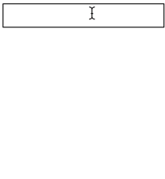

#### My [solution](https://github.com/doctor-uz/Incremental-Search).

# Incremental Search - Part 2



The url to use is `https://flame-egg.glitch.me/` and it requires a query string parameter named `q`. The value of the `q` parameter should be the value that the user has entered into the text field. For example, if the user types the letter 'a', the url should be `https://flame-egg.glitch.me/?q=a`. You should use the `data` field in the object you pass to `$.ajax` to build the query string.

```js
$.ajax({
    url: 'https://flame-egg.glitch.me/',
    data: {
        q: 'a'
    },
    success: function(data) {
        // do something with the data here
    }
});
```

This endpoint uses the exact same list of countries you used in your first version. You can delete that array as well as the code that finds matches in it. Where you used to search for matches you should now make an ajax request. You will have to wait for the response to be received before you can show results. The data passed to your success handler will be an array. For example, if the query string is `q=a`, the data would look like this:

```json
[ "Afghanistan", "Albania", "Algeria", "American Samoa" ]
```

An important thing to keep in mind is that you have no guarantee that you will receive responses to requests in the order in which you make the requests. For example, imagine the user types `a` and then `l` and then `b` in quick succession. Now imagine that the first request takes 50 milliseconds while the second request takes 150 milliseconds and the third request takes 50 milliseconds.

```
a -----50ms-----> Afghanistan
                  Albania
                  Algeria
                  American Samoa

     al ---------------150ms---------------> Albania
                                             Algeria

          alb -----50ms-----> Albania
```

Unless you take steps to prevent it, the end result of this will be a text field that says "alb" and a list of results that includes not only Albania but also Algeria.

One way to avoid this situation would be to abort any pending request you have whenever you are ready to make a new request. To do this, you would have to keep around a reference to the [`jqXHR`](http://api.jquery.com/jQuery.ajax/#jqXHR) object returned by `$.ajax` so you can call `abort` on it when/if the time comes.

Note that calling `abort` will cause any error handler you have specified for the request to run. You can detect this by checking out the second argument passed to your error handler. It will be the string `'abort'`.


